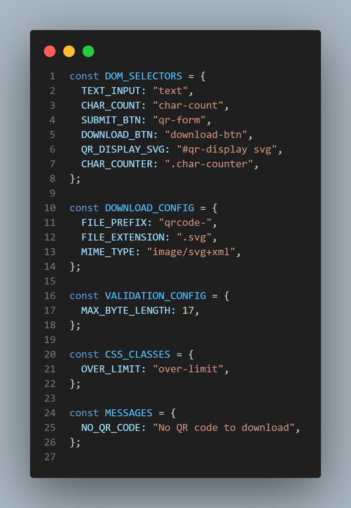
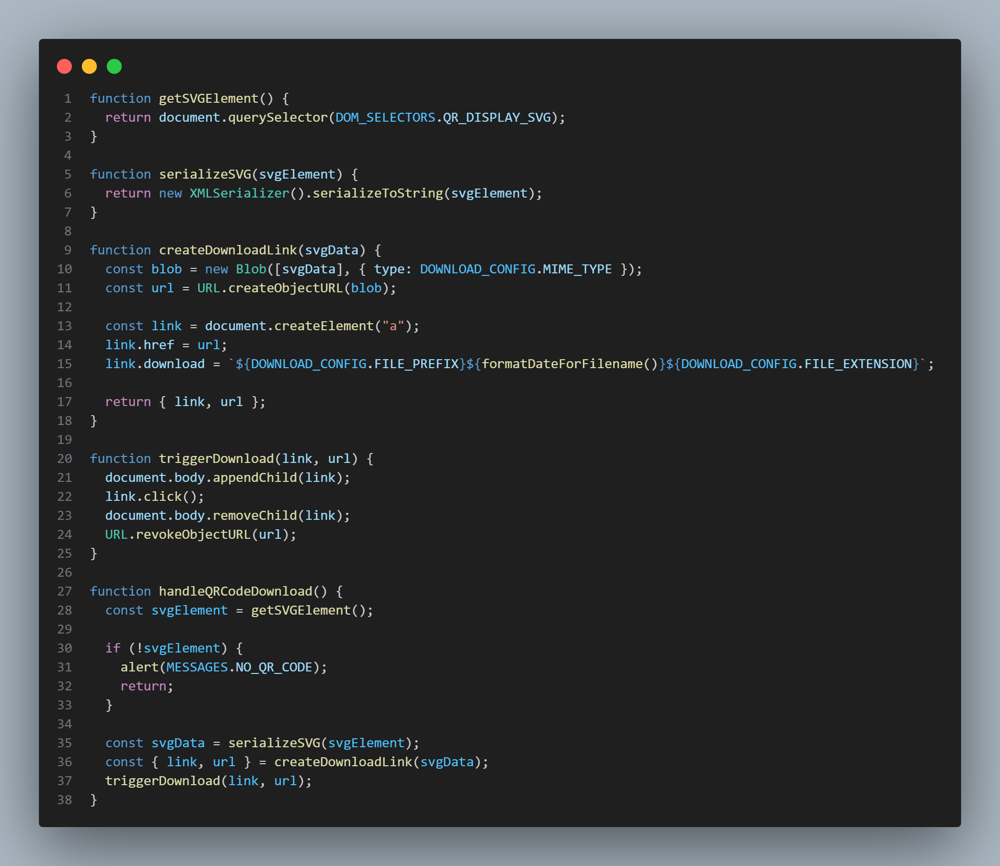
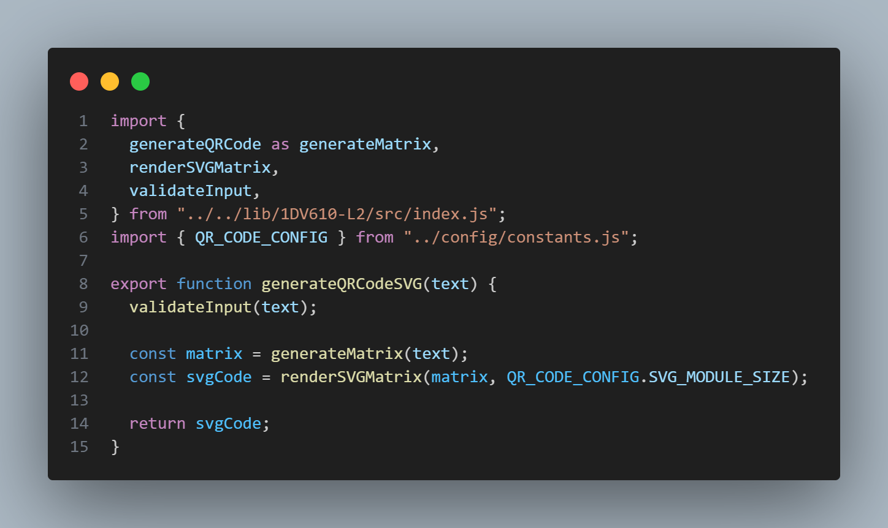
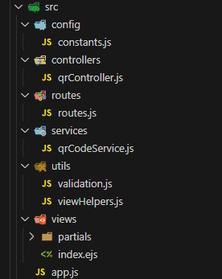

# Clean Code Reflection

Reflection for L3 following clean code chapters 2-11, covering both the QR code module and web application.

## Chapter 2: Meaningful Names

**Reflection:**
Chapter 2's principles greatly improved code readability in both the module and web application. In the module, replacing shortened names like `ecLevel` with `errorCorrectionLevel` removed mental translation. In the web application, grouping related constants into objects with descriptive names like `DOM_SELECTORS`, `DOWNLOAD_CONFIG`, and `VALIDATION_CONFIG` made the code's intent immediately clear. Function names like `handleQRCodeGeneration` and `isWithinByteLimit` clearly describe their purpose without needing comments.

## Chapter 3: Functions

**Reflection:**
Chapter 3's "do one thing" principle is visible throughout the codebase. In the module, extracting methods like `#applyMaskToCell` and `#flipBit` improved readability. The web application's client-side code demonstrates this even more clearly each function in [client.js](../public/js/client.js) has a single, clear purpose: `getByteLength` (line 28), `isOverByteLimit` (line 32), `updateSubmitButtonState` (line 36), `updateVisualFeedback` (line 43), and `formatDateForFilename` (line 75). The download feature is split into `getSVGElement`, `serializeSVG`, `createDownloadLink`, and `triggerDownload` making the flow easy to follow and each piece easy to test.

## Chapter 4: Comments

**Reflection:**
Chapter 4's message that comments should be rare resonates throughout the project. The web application contains just a few comments, the code explains itself through descriptive names. Looking at [qrController.js](../src/controllers/qrController.js), the logic is clear without any explanatory text: `showQRCodeForm` renders the form, `handleQRCodeGeneration` validates input and generates the QR code. Similarly, [client.js](../public/js/client.js) needs no comments because functions like `initializeCharacterCounter` and `handleQRCodeDownload` clearly state their purpose. The few comments kept in the module document complex QR specification details that code alone cannot convey.

## Chapter 5: Formatting

**Reflection:**
Both the module and web application follow Chapter 5's formatting principles. Files are appropriately sized: the largest web application file is [client.js](../public/js/client.js) at 139 lines, while [qrController.js](../src/controllers/qrController.js) is just 42 lines. Consistent indentation (2 spaces) and vertical spacing create clear visual boundaries. Related functions are grouped together in [client.js](../public/js/client.js) validation functions (lines 28-58), download functions (lines 75-123), and initialization functions (lines 125-138) forming distinct readable sections.

## Chapter 6: Objects and Data Structures

**Reflection:**
Chapter 6's distinction between objects and data structures is clear in the web application. Configuration objects in [constants.js](../src/config/constants.js) and [client.js](../public/js/client.js) (DOM_SELECTORS, DOWNLOAD_CONFIG) are pure data structures without behavior. The [viewHelpers.js](../src/utils/viewHelpers.js) `createViewData` function returns a simple data structure. Meanwhile, the controller and service files contain behavior: [qrCodeService.js](../src/services/qrCodeService.js) encapsulates QR code generation logic, and [validation.js](../src/utils/validation.js) hides the complexity of byte length checking behind clean function interfaces.

# Chapter 7: Error Handling

**Reflection:**
Chapter 7's principle of providing context with exceptions is evident in both codebases. The module throws descriptive errors with exact values, while the web application centralizes all error messages in [constants.js](../src/config/constants.js). The [qrController.js](../src/controllers/qrController.js) shows proper error handling flow: validation errors return user-friendly messages, while unexpected errors are caught and handled gracefully. The application uses try-catch blocks appropriately and never returns null or undefined for error cases, preventing further complications. Error messages are specific and actionable, like "Input too large. Special characters use more space. Try fewer characters."

## Chapter 8: Boundaries

**Reflection:**
Chapter 8's boundary management principles are demonstrated in how the web application wraps the QR code module. The [qrCodeService.js](../src/services/qrCodeService.js) acts as an adapter layer, isolating the rest of the application from the module's API. Only this service file imports from the module, protecting the application from potential module changes. The service provides a clean interface (`generateQRCodeSVG`) that hides implementation details.

## Chapter 9: Unit Tests

**Reflection:**
Chapter 9 reveals the biggest gap in both codebases: no automated unit tests. However, the clean code principles make testing easier if added later. The web application's small functions like `getByteLength`, `isOverByteLimit`, and `formatDateForFilename` in [client.js](../public/js/client.js) are pure functions that would be trivial to unit test. The [qrController.js](../src/controllers/qrController.js) separates concerns well, making it possible to test validation, QR generation, and error handling independently. The service layer isolation means the module could be mocked during controller tests. While the educational context explains the absence of tests, the code structure shows that clean code enables testability.

## Chapter 10: Classes

**Reflection:**
Single Responsibility Principle shines in the web application's MVC architecture. Each file has one clear purpose: [routes.js](../src/routes/routes.js) defines routing, [qrController.js](../src/controllers/qrController.js) handles HTTP requests/responses, [qrCodeService.js](../src/services/qrCodeService.js) manages QR generation, [validation.js](../src/utils/validation.js) validates input, and [constants.js](../src/config/constants.js) stores configuration. Changes to validation logic only affect validation.js, changes to error messages only affect constants.js. This separation means adding a new feature like downloading PNG instead of SVG would only require changes in specific files without touching others. The folder structure makes responsibilities immediately obvious.

## Chapter 11: Systems

**Reflection:**
Chapter 11's separation of concerns is exemplified in the web application's layered architecture. The system separates construction from use at multiple levels: [app.js](../src/app.js) constructs the Express application and wires dependencies, [routes.js](../src/routes/routes.js) maps URLs to controllers, [qrController.js](../src/controllers/qrController.js) coordinates the request flow, and [qrCodeService.js](../src/services/qrCodeService.js) isolates business logic. The data flows cleanly through layers: HTTP request -> routing -> controller -> validation -> service -> module -> response. Each layer can change independently middleware can be added in app.js without touching controllers, and the QR module could be swapped without changing the controller, only the service layer.

## Key Takeaway

Applying clean code principles during initial development was significantly easier than my usual approach of "write first, clean later." The code emerged well-organized because I was thinking about responsibilities, naming, and function size from the start. There was no big refactoring phase because the code was clean from the beginning, of course some refactoring is still needed but this is done immediately, rather than later when it could be more complex to refactor with higher coupling and lower cohesion. This experience showed that clean code principles aren't just for fixing messy code they're a better way to write code in the first place.
